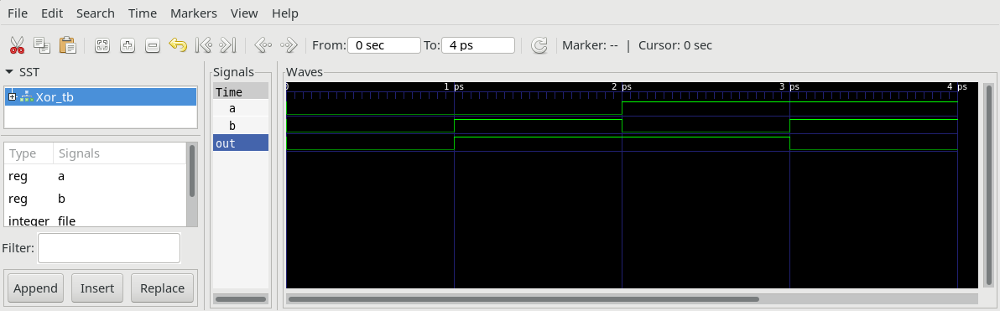

# Translation guide: HDL to Verilog

The hardware part of the project nand2tetris-13 is implemented in verilog, a hardware description language similar to HDL used in the original nand2tetris course. There is no need to learn verilog, as you can easily translate all your hdl-files into verilog following the given example for `Xor`.

**Note:**
The following modules are considered primitive and thus there is no need to implement them.

|module|description|
|-|-|
|Nand.v|Nand-gate. Basic building block for combinatorial logic|
|DFF.v|Data Flip Flop. Basic building block for sequential logic|
|RAM.v|uses Block Ram (BRAM) of iCE40|
|ROM.v|uses Block Ram (BRAM) of iCE40 preloaded with HACK-code at startup|
|Tristate.v|Tristate buffer, used to connect to databus of SRAM|


## Xor.hdl
Implementation of Xor in HDL (nand2tetris).
```
// This file is part of www.nand2tetris.org
// and the book "The Elements of Computing Systems"
// by Nisan and Schocken, MIT Press.
// File name: projects/01/Xor.hdl

/** 
* Xor (exclusive or) gate:
* If a<>b out=1 else out=0.
*/

CHIP Xor {
	IN a, b;
	OUT out;

	PARTS:
	Not(in=a, out=nota);
	Not(in=b, out=notb);
	And(a=a, b=notb, out=w1);
	And(a=nota, b=b, out=w2);
	Or(a=w1, b=w2, out=out);
}
```

## Xor.v
Xor.hdl can be translated to Xor.v (verilog).
```
/** 
* Xor (exclusive or) gate:
* If a<>b out=1 else out=0.
*/

module Xor(
	input wire a,
	input wire b,
	output wire out
);
	wire nota;		//new wire must be declared
	wire notb;
	Not NOT1(.in(a), .out(nota));	 //NOT1 is instance name
	Not NOT2(.in(b), .out(notb));
	
	wire w1;
	wire w2;
	And AND1(.a(a),.b(notb),.out(w1));
	And AND2(.a(nota),.b(b),.out(w2));

	Or OR(.a(w1),.b(w2),.out(out));
}
```

## Xor.tst
Testfile for Xor written in Testscript language of nand2tetris course.
```
// This file is part of www.nand2tetris.org
// and the book "The Elements of Computing Systems"
// by Nisan and Schocken, MIT Press.
// File name: projects/01/Xor.tst

load Xor.hdl,
output-file Xor.out,
compare-to Xor.cmp,
output-list a%B3.1.3 b%B3.1.3 out%B3.1.3;

set a 0,
set b 0,
eval,
output;

set a 0,
set b 1,
eval,
output;

set a 1,
set b 0,
eval,
output;

set a 1,
set b 1,
eval,
output;
```
## Xor_tb.v
`Xor.tst` can be translated to a so called testbench `Xor_tb.v` used to simulate `Xor.v`.
```
`default_nettype none
module Xor_tb();

	integer file;

	reg a = 0;
	reg b = 0;
	wire out;
	
	Xor XOR(
	    .a(a),
		.b(b),
	    .out(out)
	  );

	task display;
    	#1 $fwrite(file, "| %1b | %1b | %1b |\n", a,b,out);
  	endtask
  	
  	initial begin
  		$dumpfile("Xor_tb.vcd");
  		$dumpvars(0, Xor_tb);
		file = $fopen("Xor.out","w");
    	$fwrite(file, "| a | b |out|\n");
		
		a=0;b=0;
		display();
  		
		a=0;b=1;
		display();
		
		a=1;b=0;
		display();
		
		a=1;b=1;
		display();
		$finish();	
	end

endmodule
```
## Xor.out
Similar to `Xor.tst` of nand2tetris, the testbench `Xor_tb.v` generates an output-file `Xor.out`, which can then be compare to `Xor.cmp`.

### Simulation
Simulation of testbench `Xor_tb.v` is done by launching the apio command:
```
$ apio sim
```

Simulation creates `Xor.out` which can then be compared to `Xor.cmp`.
```
$ diff Xor.out Xor.cmp
```

### Xor.out
Output file of simulation.
```
| a | b |out|
| 0 | 0 | 0 |
| 0 | 1 | 1 |
| 1 | 0 | 1 |
| 1 | 1 | 0 |
```

### Xor_tb.gtkw
Simulation with `apio sim` also gives a graphical represantation `Xor.gtkw` of all signal lines, which can be viewed with gtkwave.




## Xor.pcf
To synthesize the modules and upload them to iCE40-FPGA you need one additional file `Xor.pcf` (physical constraints file). This file assigns every io-signal wire of the top-module to a pin number of the iCE40 chip. Pin numbering can be checked by consulting the  [schematic](file://../../doc/iCE40HX1K-EVB_Rev_B.pdf) at `doc/iCE40HX1K-EVB_Rev_B.pdf`.

```
# physical constrain file
# assign io-pins to pin numbering of iCE40-HX1K on olimex board iCE40-HX1K-EVB
# compare to the schematic of the board and the datasheet of fpga

set_io a 41
set_io b 42

set_io out 40

```
## Project
* Build and upload  the module `Xor` to iCE40-HX1K-EVB with:
```
$ apio upload
```

**Congratulations**, you have implemented Xor in real hardware. Press buttons (pin 41,42) of iCE40-HX1K-EVB and look at the led (pin 40).