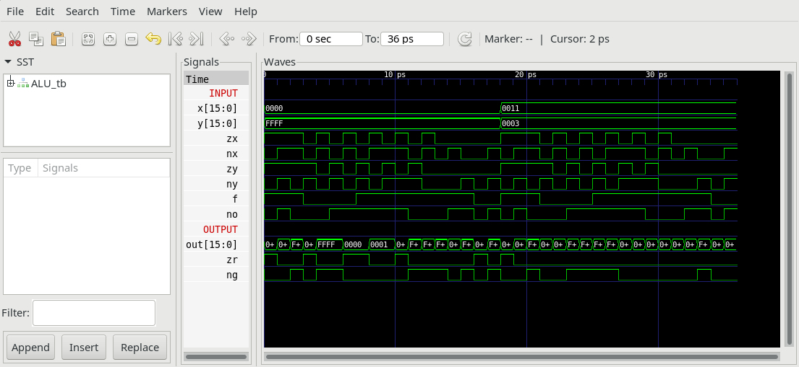

## ALU.v
The ALU (Arithmetic Logic Unit).

Computes one of the following functions: x+y, x-y, y-x, 0, 1, -1, x, y, -x, -y, !x, !y, x+1, y+1, x-1, y-1, x&y, x|y on two 16-bit inputs, according to 6 input bits denoted zx,nx,zy,ny,f,no. In addition, the ALU computes two 1-bit outputs: if the ALU output == 0, zr is set to 1; otherwise zr is set to 0; if the ALU output < 0, ng is set to 1; otherwise ng is set to 0.

Implementation: the ALU logic manipulates the x and y inputs and operates on the resulting values, as follows:
* if (zx == 1) set x = 0 16-bit constant
* if (nx == 1) set x = !x bitwise not
* if (zy == 1) set y = 0 16-bit constant
* if (ny == 1) set y = !y bitwise not
* if (f == 1)  set out = x + y integer 2's complement addition
* if (f == 0)  set out = x & y bitwise and
* if (no == 1) set out = !out bitwise not
* if (out == 0) set zr = 1
* if (out < 0) set ng = 1

## ALU_tb.v

Testbench performs some operations with ALU and generates `ALU.out`, which can be compared to `ALU.cmp`.

## Project
* Implement the ALU and all needed submodules (Add16, And16, And, FullAdder, HalfAdder, Mux16, Mux, Not16, Not, Or8Way, Or, Xor).

Use translation Guide at `00_Requirement/Xor` to see how HDL-files translate into verilog.
  
**Note:** Nand is considered primitive and thus there is no need to implement it.

* Simulate your implementation with the supplied Testbench `ALU_tb.v`.

* Verify by comparing `ALU.out` with `ALU.cmp`.