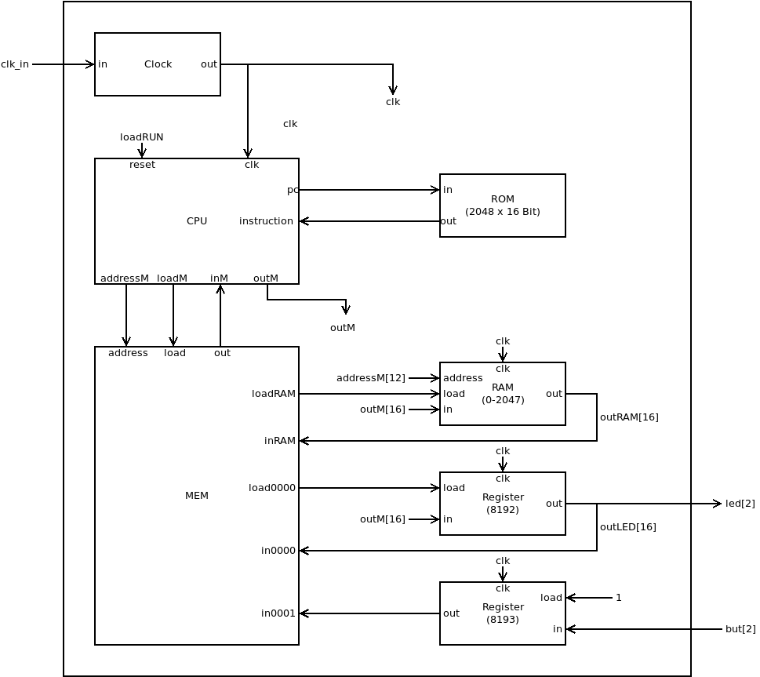

## Hack1.v
Hack1 is a minimal version of our hack computer consisting of  six hardware modules (Clock, CPU, ROM, RAM, Memory, Register). The memory can address 2048 words of RAM plus two registers mapped to I/O, with which we can control button and leds on the board. ROM of 2048 words will be preloaded with small assembler programs to test the hardware.



### Memory map
|address | memory|R/W|function|
 |-|-|-|-|
 |0-2047  | RAM|R/W|R0--R15, static, stack, heap|
 | 8192    | but|R/W|0 = button pressed, 1 = button released|
 | 8193    | led|R/W|0 = led off, 1 = led on|
 

## Hack1.pcf
Hack1 connects over external pins of our fpga to Oscillator 100 MHz (clk_in), the two buttons (but[1:0]) and the two leds (led[1:0]).

## Hack1_tb.v
Testbench, that simulates closing and opening of buttons but[1:0].


## Project
* Implement `Hack1.v` and all needed submodules.
* Check the [schematic](../doc/iCE40HX1K-EVB_Rev_B.pdf) of your board to find the pin numbers connected to buttons, leds and the external oscillator and add pin numbering to `Hack1.pcf`
* Preload instruction memory `ROM.v` with `led.hack`.
* Simulate with `apio sim` and compare the signal output with the screenshoot of `Hack1_tb.png`. 
* Build and upload to real hardware:  
```
$ apio build
$ apio upload
```
* Test Hack1 with `asm/led` by pressing the buttons.  
 **Note:** Due to pullup resistors pressed button corresponds to logic 0 and a released button corresponds to logic 1.
 
 * Repeat with `asm/blinky`.

